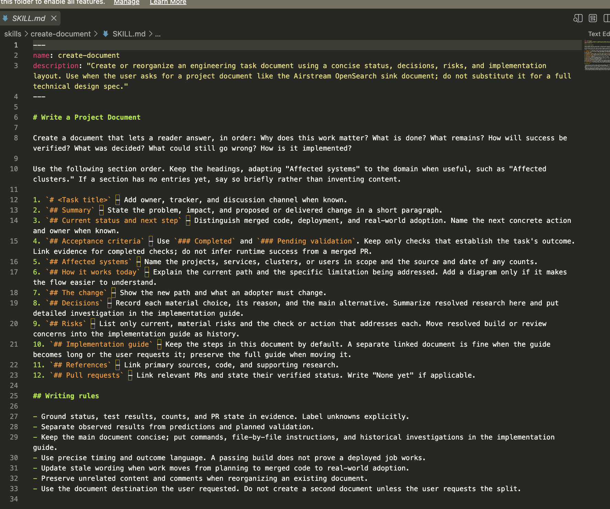

+++
date = '2026-09-22T18:35:32-03:00'
title = 'My Development Workflow in the AI Era'
summary = "In the AI era, the hardest part of development is no longer writing code — it's planning and reviewing what AI generates."

[cover]
  image = 'cover.jpg'
  alt = 'Green forest'
  relative = true
  hiddenInList = true
+++

In the AI era, the hardest part of development is no longer writing code. It's planning. Architectural decisions are now much harder than the implementation itself, and so is reviewing the generated code to make sure it isn't slop.

With that in mind, my workflow focuses on producing a solid design document: the details and reasoning behind each decision, the alternatives considered, their pros and cons, and why one option was chosen over another. I then have different models, each in a fresh context window, analyze the document over multiple rounds so I can refine it and make sure everything holds together.

The document also includes an implementation section listing every file that needs to change, which repository it lives in, and enough detail for an LLM to implement it.

After a few iterations, I move on to implementation. I review the code manually, then do several more rounds of review and questioning with LLMs. I also use a few skills to help me polish the document's grammar and remove AI-sounding phrasing, such as [unslop](https://github.com/cursor/plugins/tree/main/pstack/skills/unslop).

This approach has worked especially well on teams. My teammates contribute by reviewing and commenting on the documents, so the whole process gets documented as it happens. As for the coding itself, I mostly work in the terminal and use the IDE only to review the generated code. I'm not naming specific tools, because almost any will work. It really helps if the tool has an MCP server, so the agent can write directly to it.

I also created a [skill](https://github.com/bruno-pagno/dotfiles/blob/main/claude/skills/create-document/SKILL.md) with a basic structure I like to follow in my documents. It includes a summary, current status, affected systems, decisions, risks, and so on.

I guess what I'm describing is what some people call "Spec-Driven Development" or "Request for Comments (RFC)," but I don't follow any specific rules. This approach grew out of problems I ran into daily, like the ["lost in the middle"](https://pub.towardsai.net/lost-in-the-middle-629b20d86152) problem with long contexts, and accidentally losing chats.

My workflow is still evolving, so I may update this post in the near future. Thanks for reading!
